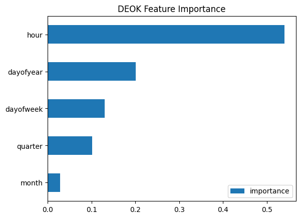
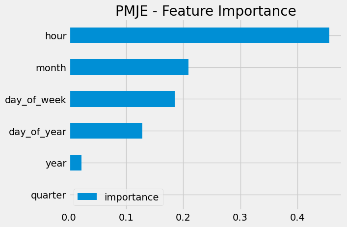
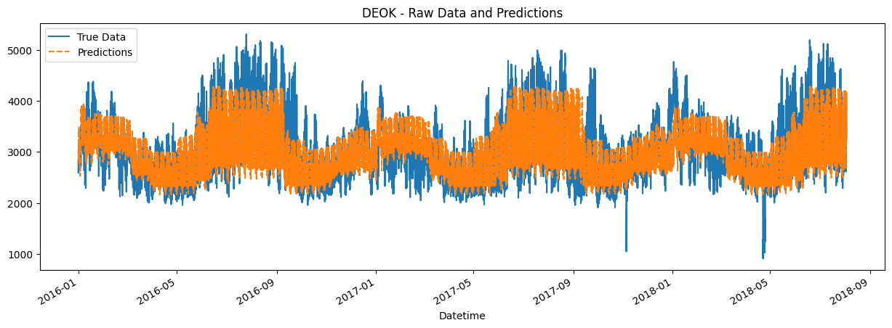
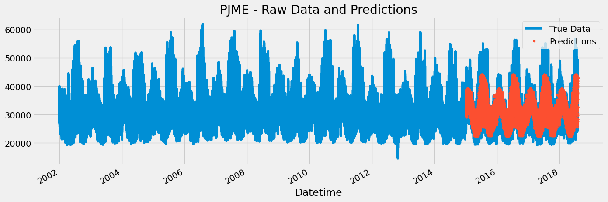

# Time Series Forecasting - Energy Usage
Exploring time based predictions using a dataset of multiple energy companies.

## Insights
1. Hour of the day is the number one predictor of energy usage for these companies. This isn't surprising because there is clearly much more usage during the day than at night.

2. For DEOK, even though I thought month would be important because it was for PMJE, the specific day of the year is more related and was a better indicator for the prediction. The day of the year also acts as a proxy for month, so that makes sense.

3. For predicting, what's clear is that the predictions don't have as much variability as the real data. It ends up being conservative in it's estimates away from the mean.

