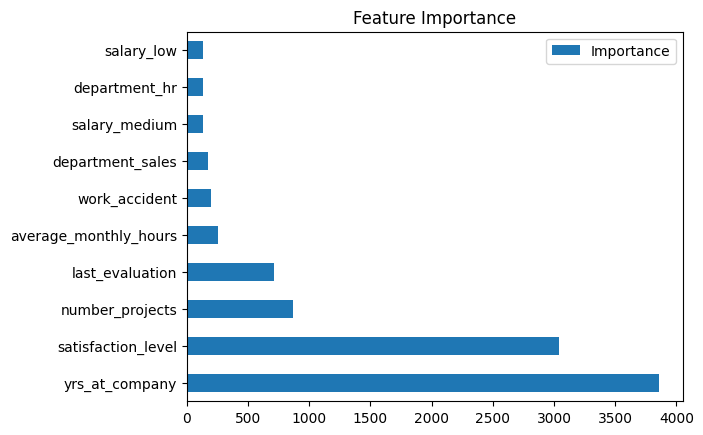

# Google Capstone - Employee Retention

This is my Capstone project for the Advanced Data Analytics course from Google.

The goal of this project is to build a model to predict whether or not an employee will leave the company.

## Insights
What I found using both Random Forest and XGBoost classifiers was that the employee's satisfaction level as well as the number of projects and average hours worked were very important in determining retention for the Salifort Motors company.

Both of the models ended up being very good across all of our metrics, and they aren't much different from one another in their effectiveness.

<table border="1" class="dataframe">
  <thead>
    <tr style="text-align: right;">
      <th></th>
      <th>Model</th>
      <th>Accuracy</th>
      <th>Precision</th>
      <th>F1</th>
      <th>Recall</th>
    </tr>
  </thead>
  <tbody>
    <tr>
      <th>0</th>
      <td>Random Forest GS</td>
      <td>0.98197</td>
      <td>0.983106</td>
      <td>0.944273</td>
      <td>0.908556</td>
    </tr>
    <tr>
      <th>0</th>
      <td>XGBoost GS</td>
      <td>0.98209</td>
      <td>0.981841</td>
      <td>0.944735</td>
      <td>0.910681</td>
    </tr>
  </tbody>
</table>

